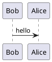

# cleanCppProj Documentation

This directory contains all documentation for the **cleanCppProj** project.

## Build Docs



To generate the HTML documentation:

```bash
cmake -S . -B build -DBUILD_DOXY_DOCS=ON -DBUILD_TESTS=OFF
cmake --build build --target doxy-docs
```